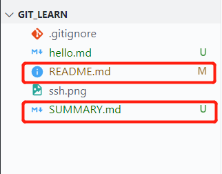
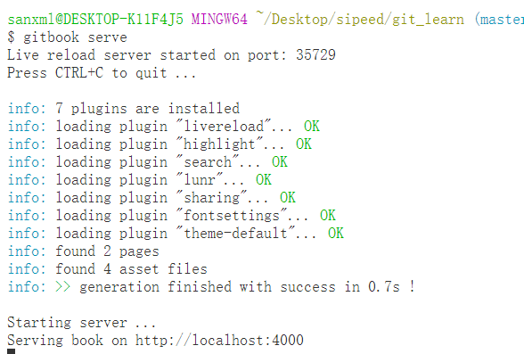

# 学习使用 git


## 基本指令

``` shell
git add //添加进仓库

git commit -m //添加修改了哪些内容

git status //显示工作区状态

git log //查看日志（git log --pretty=oneline）

git reflog //查看历史记录

git reset //恢复到某个版本（git reset --hard）
```

## 线上仓库指令

``` shell
git clone //克隆线上仓库到一个新目录（http协议或者ssh协议）

git push //提交到线上仓库的操作（修改权限，在.git/config里http://账号：密码@github.com）

git pull //拉取线上仓库到本地

ssh-keygen -t rsa -C "sanxml@foxmail.com"
//创建公钥复制 ~/.ssh/id_rsa.pub 到github，上传公钥
```

## 分支操作

``` shell
git branch //查看分支

git branch //分支名 添加分支

git checkout //分知名 切换分支

git branch -d //删除分支

git merge //分支名 合并分支
```

## 忽略文件操作

> * 新建.gitignore，编写规则
> * 忽略文件上传，常用于不做更改的文件，如图片等

## 查看帮助

> git --help 查看帮助


# 学习 github


## 已有仓库调用

### 1. git设置密钥

``` shell
ssh-keygen -t rsa -C "sanxml@foxmail.com"
```

### 2. 将公钥添加到仓库

``` shell
cat ~/.ssh/id_rsa.pub
```

将输出的公钥复制，添加到仓库中


### 3. 克隆仓库

``` shell
git clone https://github.com/sanxml/git_learn.git
```

### 4. 联系本地仓库和远程仓库

``` shell
git remote add origin git@github.com:sanxml/git_learn.git
```

### 5. 更改和提交

``` shell
git add README.md
git commit -m "update README.md"
```

### 6. 推送到远程仓库

``` shell
git push -u origin master //远程仓库空时
git push origin master
```


# 学习使用gitbook

### 1. 初始化gitbook

``` shell
gitbook init
```
多出两个文件，README.md为介绍文件，SUMMARY.md为章节目录文件



### 2. 编辑SUMMARY.md


编辑后还需要重新`gitbook init`

### 3. 启动服务，预览

``` shell
gitbook serve
```


> 打开 http://localhost:4000 预览


### 4. 生成静态网页

``` shell
gitbook build
```
