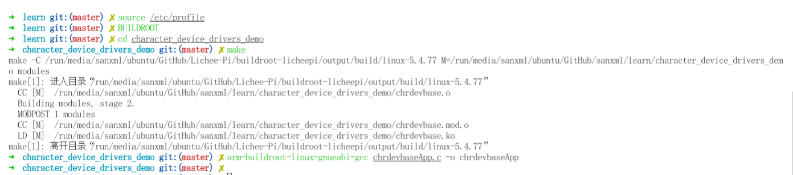

# 字符设备驱动开发

## 前言

Linux 中有三大类驱动：字符设备驱动、块设备驱动和网络设备驱动。

**字符设备**是 Linux 驱动中最基本的一类设备驱动，字符设备就是一个一个字节，按照字节
流进行读写操作的设备，读写数据是分先后顺序的。比如我们最常见的点灯、按键、IIC、SPI，
LCD 等等都是字符设备，这些设备的驱动就叫做字符设备驱动。

这里使用了licheepi-nano这一款linux开发板，需要提前安装好内核和uboot,以及如何烧录镜像等

本文不做详细讲解，以下链接为[编译文件源码](https://github.com/sanxml/buildroot-licheepi.git)

## 字符设备简介

在 Linux 中一切皆为文件，驱动加载成功以后会在“/dev”目录下生成一个相应的文件，应
用程序通过对这个名为“/dev/xxx”的文件进行相应的操作即可实现对硬件的操作。

比如有个叫做 **/dev/led** 的驱动文件，此文件是 led 灯的驱动文件。

应用程序使用 **open** 函数来打开文件/dev/led，

使用 **close** 函数关闭/dev/led，

使用 **write** 函数来写操作，就是写入要关闭还是要打开 led 的控制参数，

使用 **read** 函数从驱动中读取相应的状态，获取led 灯的状态，

## 开发步骤

1. 驱动模块的加载和卸载

    驱动模块加载有两种运行方式，第一种就是将驱动编译进 Linux 内核中,第二种就是将驱动编译成模块(扩展名为.ko)

    使用命令“**insmod**” 或者 “**modprobe**”加载驱动ko模块，前者加载时不会加载依赖的模块。

    ``` shell
    insmod drv.ko
    # 或者
    modprobe drv.ko
    ```

    驱动模块的卸载使用命令“**rmmod**”或者“**modprobe -r**”

    ``` shell
    rmmod drv.ko
    # 或者
    modprobe -r drv.ko
    ```

    > 注意：使用 **modprode** 时，需要把模块放到`/lib/modules/xxx(linux版本号)/`文件夹下

    加载和卸载都需要在驱动程序中添加:

    ``` c

    /* 驱动入口函数 */
    static int __init xxx_init(void)
    {
    /* 入口函数具体内容 */
    return 0;
    }

    /* 驱动出口函数 */
    static void __exit xxx_exit(void)
    {
    /* 出口函数具体内容 */
    }

    /* 将上面两个函数指定为驱动的入口和出口函数 */
    module_init(xxx_init);
    module_exit(xxx_exit);

    ```

2. 字符设备注册与注销

    对于字符设备驱动而言，当驱动模块加载成功以后需要注册字符设备，同样，卸载驱动模块的时候也需要注销掉字符设备。

    函数原型如下所示：

    ``` c
    static inline int register_chrdev(unsigned int major, const char *name, const struct file_operations *fops)
    static inline void unregister_chrdev(unsigned int major, const char *name)
    ```

3. 实现设备的具体操作函数

    现在是要定义设备操作函数的结构体，还需要初始化其中的 open release read write 等具体的设备操作函数。

    示例代码如下：

    ``` c
    /* 打开设备 */
    static int chrtest_open(struct inode *inode, struct file *filp)
    {
    /* 用户实现具体功能 */
    return 0;
    }

    /* 从设备读取 */
    static ssize_t chrtest_read(struct file *filp, char __user *buf,size_t cnt, loff_t *offt)
    {
    /* 用户实现具体功能 */
    return 0;
    }

    /* 向设备写数据 */
    static ssize_t chrtest_write(struct file *filp,const char __user *buf,size_t cnt, loff_t *offt)
    {
    /* 用户实现具体功能 */
    return 0;
    }
    /* 关闭/释放设备 */
    static int chrtest_release(struct inode *inode, struct file *filp)
    {
    /* 用户实现具体功能 */
    return 0;
    }

    static struct file_operations test_fops = {
    .owner = THIS_MODULE,
    .open = chrtest_open,
    .read = chrtest_read,
    .write = chrtest_write,
    .release = chrtest_release,
    };
    ```

4. 其他细节

    添加license和作者信息

    ``` c
    MODULE_LICENSE() //添加模块 LICENSE 信息
    MODULE_AUTHOR() //添加模块作者信息
    ```

## 快速上手

1. 准备

    这里展示使用简单的示例，具体详细的驱动代码和测试程序可以查看[文件夹](character_device_drivers_demo)

    下载镜像源码并编译，这里不详细赘述，交叉编译链路径在 `buildroot-licheepi/output/host/bin` , linux内核源码路径在 `buildroot-licheepi/output/build/linux-5.4.77`

2. 设置交叉编译链环境并编译程序

    将以下内容添加到/etc/profile中，这里使用了动态设置环境变量

    ``` vim
    alias BUILDROOT="export ARCH=arm export CROSS_COMPILE=arm-buildroot-linux-gnueabi- export PATH='$PATH:/my_path/buildroot-licheepi/output/host/bin/'"
    ```

    使能配置

    ``` shell
    source /etc/profile
    BUILDROOT
    ```

    编译驱动程序和测试程序

    ``` shell
    make # 编译驱动文件
    arm-buildroot-linux-gnueabi-gcc chrdevbaseApp.c -o chrdevbaseApp # 编译测试文件
    ```

    

3. 简单测试

    使用串口终端工具连接licheepi，将前面编译后的可执行文件拷贝到licheepi中

    ``` shell
    insmod chrdevbase.ko # 加载驱动文件
    mknod /dev/chrdevbase c 200 0 # 创建设备节点文件
    chmod a+x chrdevbaseApp # 设置可执行文件的权限
    ```

    测试与结果如下所示

    ``` shell

    # ./chrdevbaseApp /dev/chrdevbase 1
    [ 2284.067808] kernel senddata ok!
    read data:kernel data!

    # ./chrdevbaseApp /dev/chrdevbase 2
    [ 2288.015031] kernel recevdata ok!
    write data:usr data!

    ```
