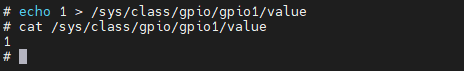

# **LED驱动开发**

## **前言**

Linux内核中gpio是最简单，最常用的资源(和 interrupt , dma , timer 一样)驱动程序，应用程序都能够通过相应的接口使用gpio，gpio使用0～MAX_INT之间的整数标识，不能使用负数,gpio与硬件体系密切相关的,不过linux有一个框架处理 gpio。

## **Linux下GPIO的使用**

下面来介绍Linux下的GPIO的使用，主要有两种，一种是通过sysfs方式，另一种是在内核下使用

### **通过sysfs方式控制GPIO**

通过 sysfs 方式控制 GPIO，先访问 `/sys/class/gpio` 目录，向 export 文件写入 GPIO 编号，使得该 GPIO 的操作接口从内核空间暴露到用户空间，GPIO 的操作接口包括 direction 和 value 等，direction 控制 GPIO 方向，而 value 可控制 GPIO 输出或获得 GPIO 输入。文件 IO 方式操作 GPIO，使用到了4个函数 open、close、read、write。

1. 进入`/sys/class/gpio` 目录

    ``` shell
    cd /sys/class/gpio
    ```

    

    export 文件用于通知系统需要导出控制的 GPIO 引脚编号。
    unexport 用于通知系统取消导出。
    gpiochipX 目录保存系统中 GPIO 寄存器的信息，包括每个寄存器控制引脚的起始编号 base，寄存器名称，引脚总数。

2. 导出GPIO，或者取消导出

    ``` shell
    echo 1 > /sys/class/gpio/export
    cd gpio1    #注意荔枝派这里的gpio1代表PA1，而PE0为32*4+0，即gpio128
    ```

    

    可以看到，在`/sys/class/gpio`目录下，生成了`gpio1`文件夹

    如果想要取消GPIO的导出，可以往`/sys/class/unexport`写入

    ``` shell
    echo 1 > /sys/class/gpio/unexport
    ```

3. 设置GPIO的方向和查看方向

    ``` shell
    echo out > /sys/class/gpio/gpio1/direction # 设置gpio1为输出
    cat /sys/class/gpio/gpio1/direction # 查看gpio1方向
    ```

    

4. 设置和查看输出值

    ``` shell
    echo 1 > /sys/class/gpio/gpio1/value # 设置gpio1输出值
    cat /sys/class/gpio/gpio1/value # 查看输出值
    ```

    

### **内核中GPIO的使用**

具体的gpio可以查看linux内核源码的下的 `gpio.h`

- 测试gpio端口是否合法

``` c
int gpio_is_valid(int number);
```

- 申请gpio端口

``` c
int gpio_request(unsigned gpio, const char *label)
```

- 设置gpio方向

``` c
/*成功返回零失败返回负的错误值*/
int gpio_direction_input(unsigned gpio);
int gpio_direction_output(unsigned gpio, int value);
```

设置和获得gpio引脚的值(方向为输出时)

``` c
int gpio_get_value(unsigned gpio);
void gpio_set_value(unsigned gpio, int value);
```

gpio当作中断口使用

``` c
int gpio_to_irq(unsigned gpio);

```

可以查看[示例](character_device_drivers_demo/led_chrdev.c)
