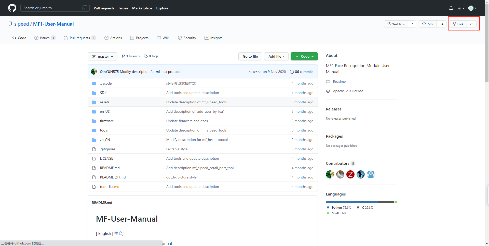
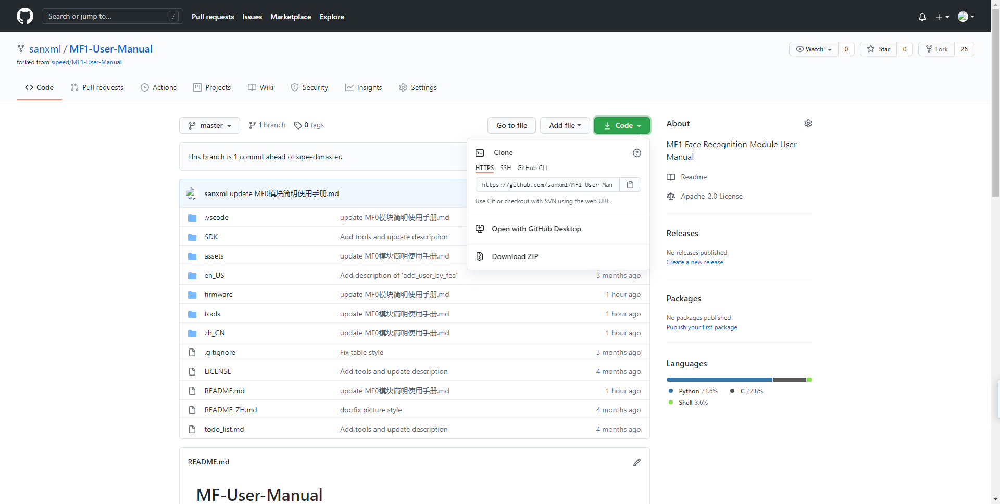
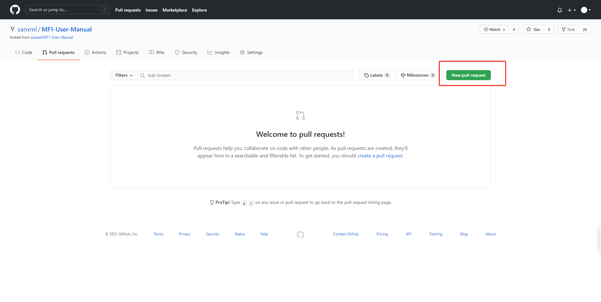

# 对开源仓库提交PR

## fork

选择自己想要的开源项目，fork到自己的仓库


### clone

将远程仓库克隆到本地仓库

``` shell
git clone https://github.com/sanxml/MF1-User-Manual.git          // 克隆远程仓库到本地
git remote add https://github.com/sanxml/MF1-User-Manual.git       // 本地仓库与远程仓库连接
git remote add upstream https://github.com/sipeed/MF1-User-Manual    // 与上游远程仓库连接
git remove -v                               //查看连接
```



## 创建分支

``` shell
git checkout -b XXX         //创建分支
```

## 修改代码并提交

``` shell
git add XXX             // 添加修改
git commit -m "修改了XXX"     // 添加修改文档
git push origin master       // 提交修改
```

## 提交PR

在GitHub上找到fork的仓库，找到 New pull request

然后点Create pull request写好名字，写好说明，提交，就OK啦。