# raspberry入门

## 烧录镜像

1. 下载烧录软件（[balenaEtcher](https://www.balena.io/etcher/)）


2. 下载树莓派镜像([下载地址](https://www.raspberrypi.org/software/operating-systems/#raspberry-pi-os-32-bit))

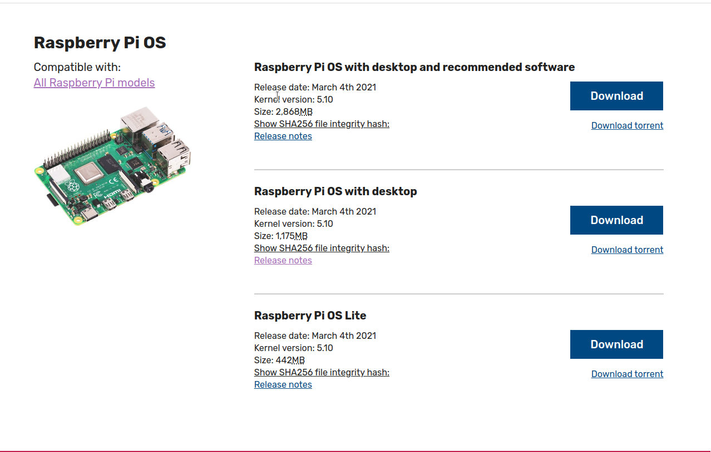

3. 插入sd卡，打开balenaEtcher,分别选择 `解压好的镜像(.img后缀文件)` 和 `sd卡 `，点击开始烧录镜像

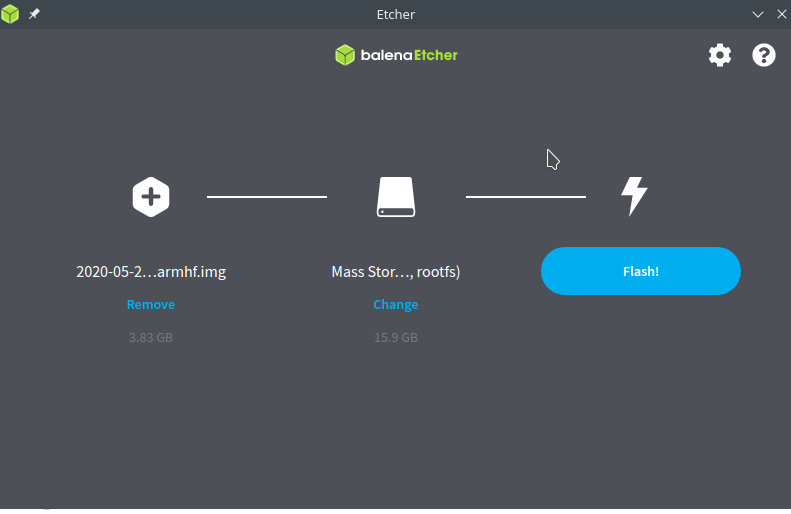

等待几分钟。。。

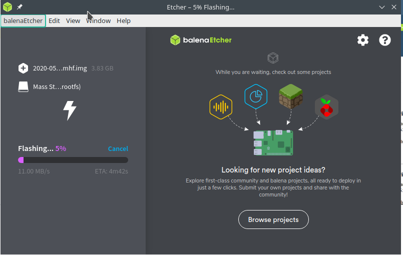

4. 打开 `boot` 文件夹，添加 `wpa_supplicant.conf` 文件，树莓派启动后会自行读取 `wpa_supplicant.conf` 配置文件连接 WiFi 设备。

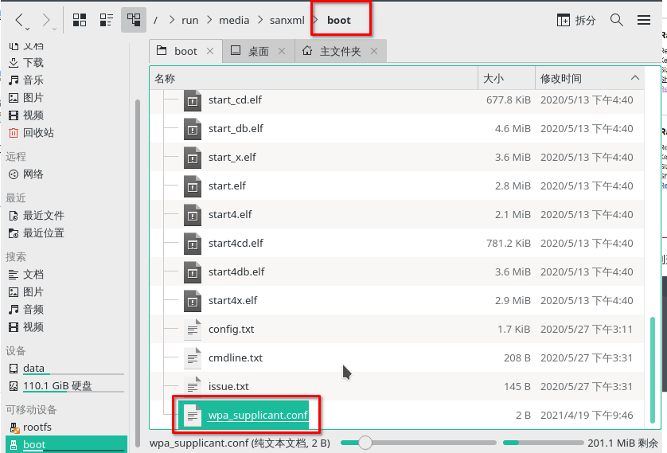

在`wpa_supplicant.conf` 文件中写入以下内容，ssid 为 wifi 名称， psk 为 wifi 密码。


```
country=CN
ctrl_interface=DIR=/var/run/wpa_supplicant GROUP=netdev
update_config=1

network={
ssid="WiFi-A"
psk="12345678"
key_mgmt=WPA-PSK
priority=1
}

network={
ssid="WiFi-B"
psk="12345678"
key_mgmt=WPA-PSK
priority=2
scan_ssid=1
}
```

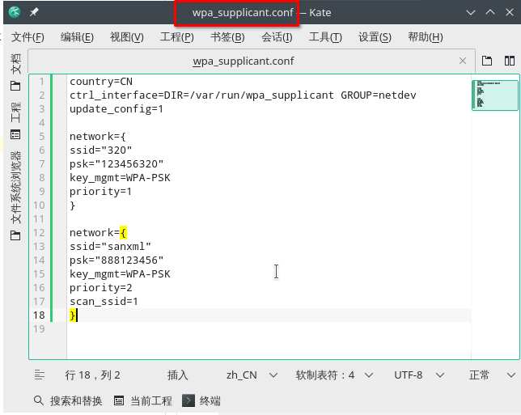


5. 打开`boot`文件，添加 `ssh` 空文件,树莓派启动后就会开启 ssh 服务

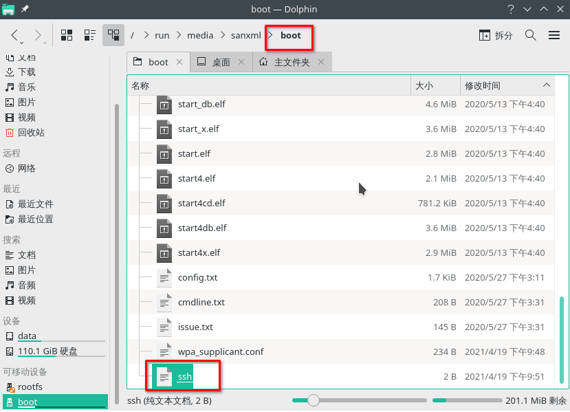


## 搭建 vscode 编辑树莓派的环境

1. 将sd卡插入树莓派,启动树莓派。

2. 获得树莓派ip地址

    * 登录路由器管理界面查看,这里使用的是 tp-link 路由器,地址为 [192.168.1.1](192.168.1.1)

    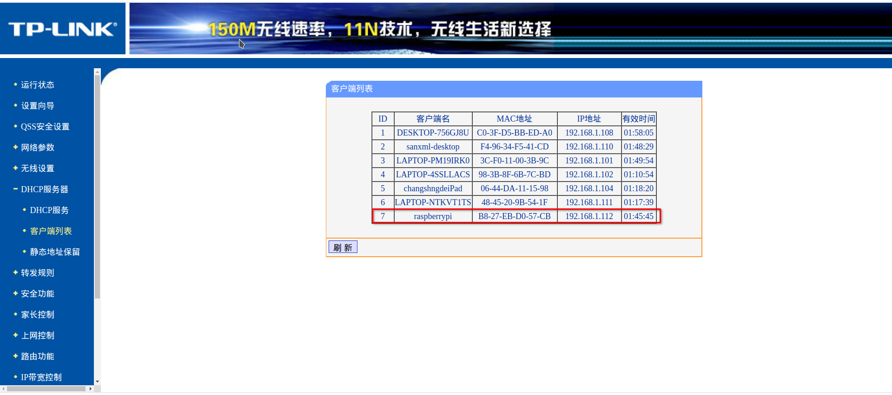

    * linux 系统使用 `nmap` 工具,这里的系统为 manjaro ,下面介绍 `nmap` 工具安装和使用

    安装
    ```shell
    sudo pacman -S nmap
    ```

    使用
    ```shell
    sudo nmap -sS 192.168.1.0/24
    ```

    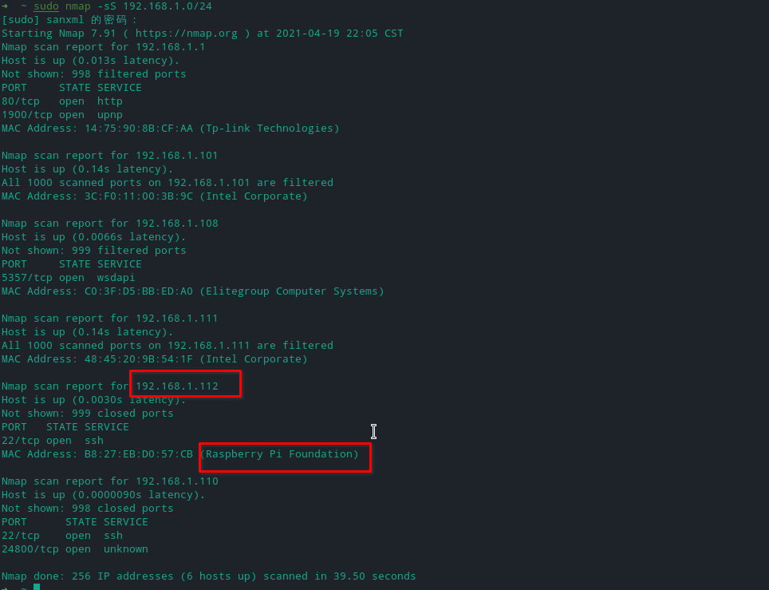

3. 下载 [vscode](https://code.visualstudio.com/) 和 `Remote - SSH` 插件

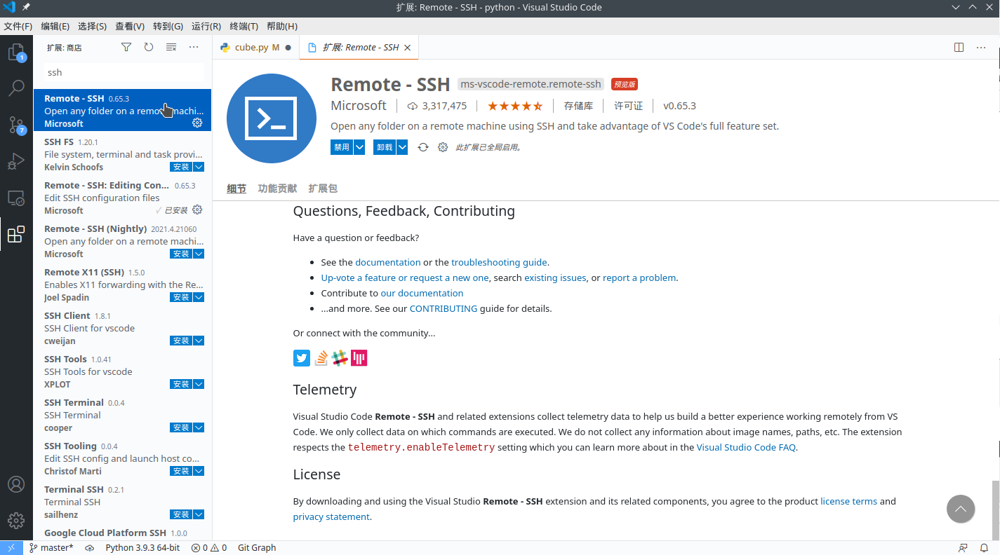

4. 使用vscode远程开发树莓派

    * 点击右侧的ssh的图标,新建连接

    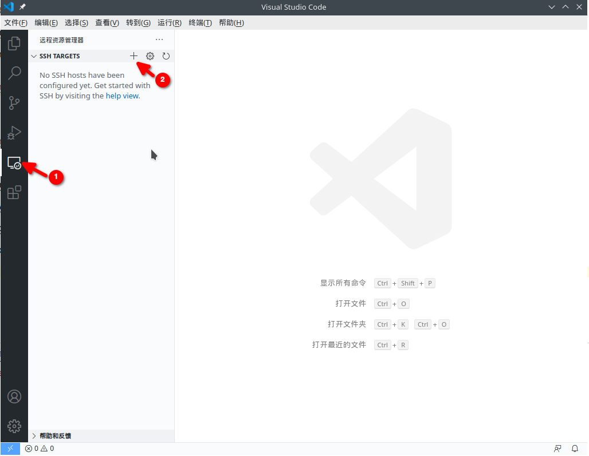

    * 输入ssh指令,如下所示

    ```shell
    ssh pi@192.168.1.112
    ```

    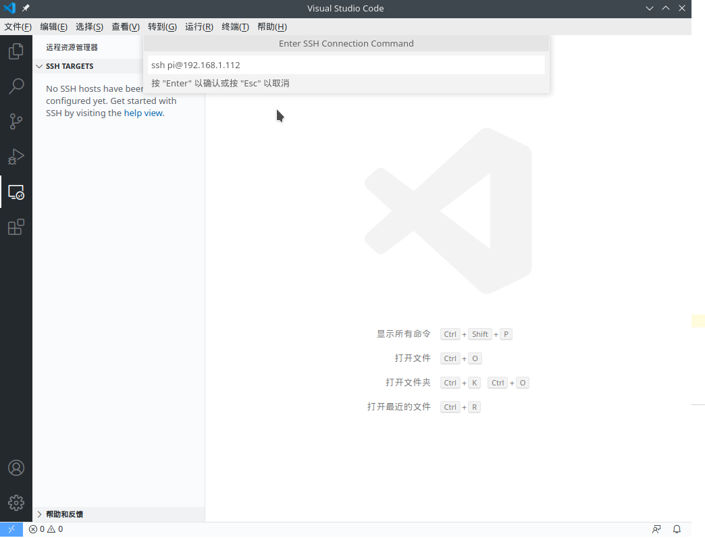

    * 远程链接,并输入密码(默认密码为 `raspberry`)

    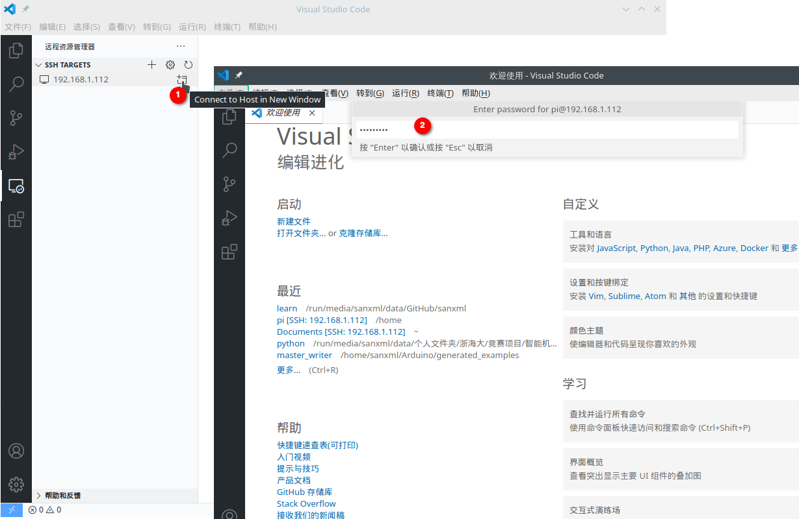

    * 打开文件夹,就可以愉快的开发了

    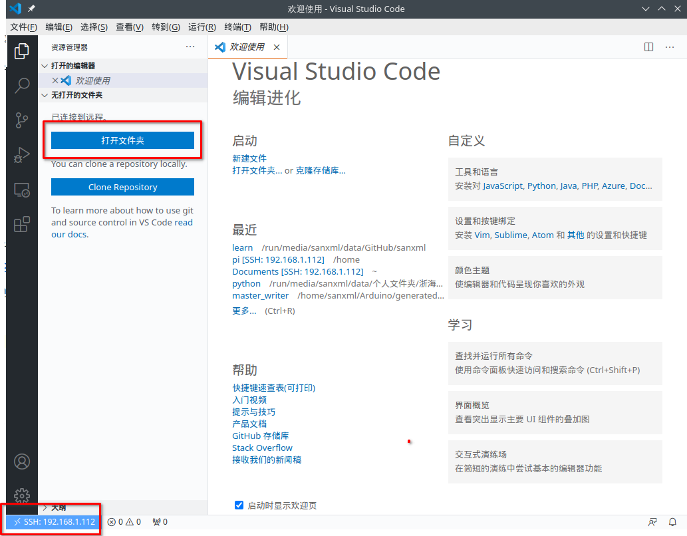

    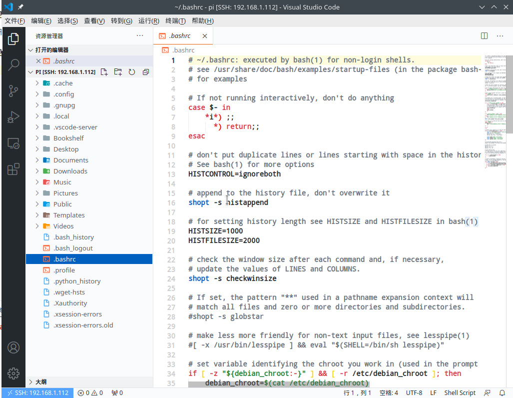