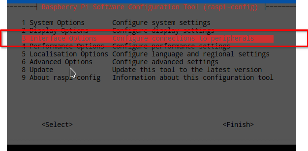
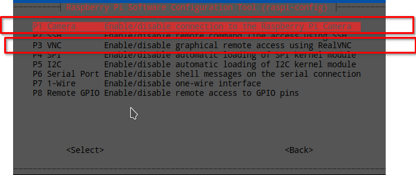
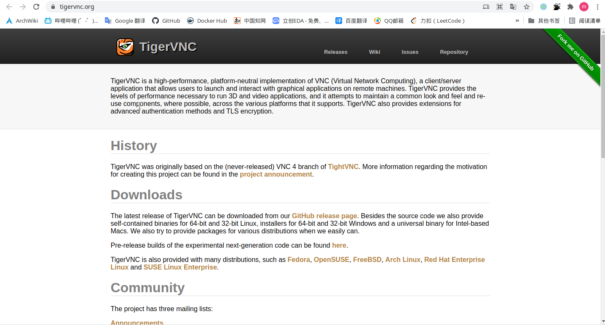
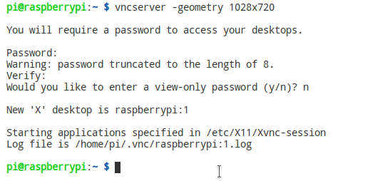
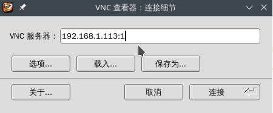
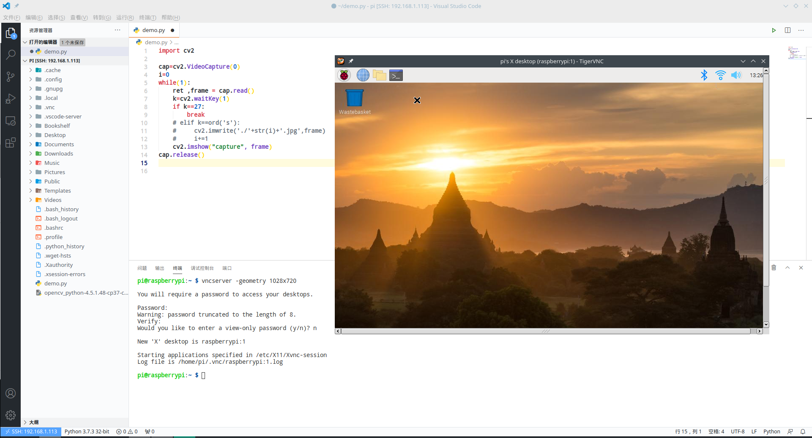
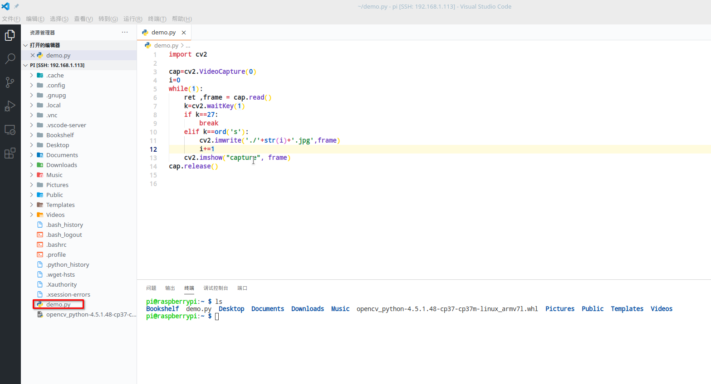
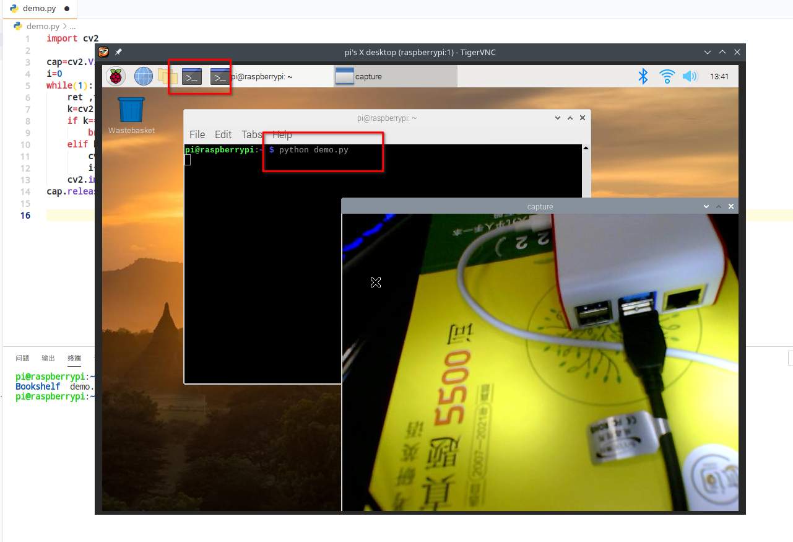

# 树莓派 opencv 调用摄像头

## 树莓派开启 camera 和 vnc 服务

``` shell
sudo raspi-config # 打开树莓派设置界面
```

选择第三个设置,回车.



开启 camera 和 vnc 服务,第一个和第三个都需要enabled.



``` shell
sudo reboot # 重启树莓派
```

## 下载 vnc 软件

- 个人电脑中下载 vnc 软件 , 比如: RealVNC, VNC Viewer, TightVNC, TigerVNC等等, 博主这里使用的是 TigerVNC

    

- 树莓派在打开 vnc 服务时,会默认下载 RealVNC,博主使用TigerVNC时无法连接,只能下载了TightVNC

    ``` shell
    sudo apt install tightvncserver  # 下载TightVNC
    vncserver -geometry 1028x720   # 开启 vnc ,输入连接的密码,修改分辨率为 1028x720
    ```

    

- 远程连接树莓派,打开vnc软件,输入树莓派ip地址,后缀 `:1` 为窗口的端口号,再输入上面设置的链接密码,即可连接成功.

    

    

## opencv 调用摄像头实例程序

因为树莓派自带的 python 编辑器不是很好有,所以这里使用 vscode 开发(具体介绍看第一章),新建 `demo.py` 文件,示例程序内容如下:

```python
import cv2

cap=cv2.VideoCapture(0)
i=0
while(1):
    ret ,frame = cap.read()
    k=cv2.waitKey(1)
    if k==27:           #按下ESC退出窗口
        break
    elif k==ord('s'):   #按下s保存图片
        cv2.imwrite('./'+str(i)+'.jpg',frame)
        i+=1
    cv2.imshow("capture", frame)
cap.release()
```



> `注意`: 因为 vscode 是使用的 ssh 连接树莓派,如果直接在 vscode 中运行会报错,无法调用窗口.

在vnc远程端口中打开终端,运行示例程序

```shell
python demo.py
```


