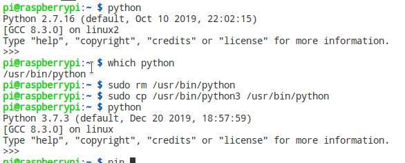
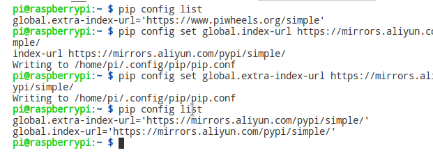
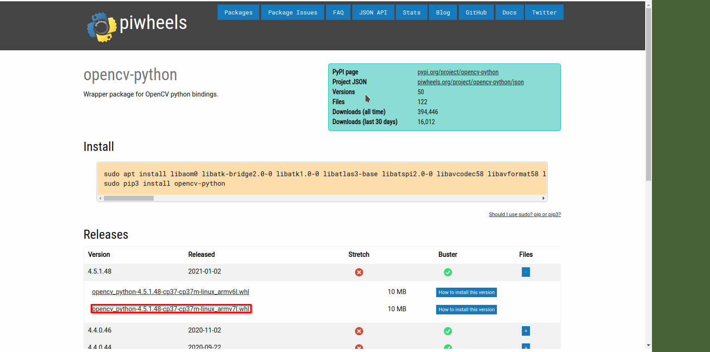
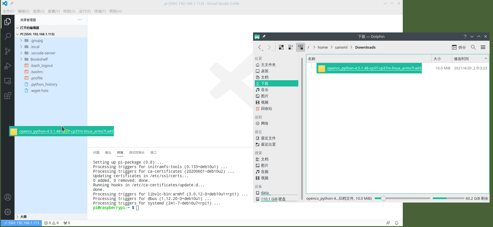
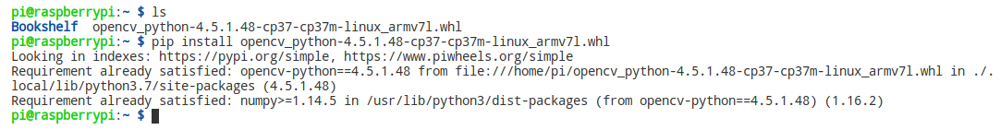
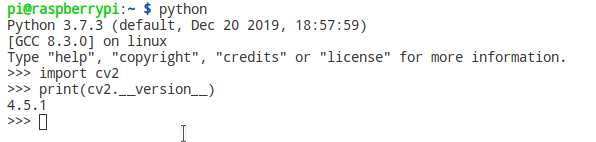

# 树莓派 opencv 环境的搭建

## 树莓派默认为 python 2, 修改默认 python 为 python 3

``` shell
sudo rm /usr/bin/python
sudo cp /usr/bin/python3 /usr/bin/python
```



## pip换源

查看 pip 设置

``` shell
pip config list
```

pip换国内源

``` shell
# 阿里源
pip config set global.index-url https://mirrors.aliyun.com/pypi/simple/
pip config set global.extra-index-url https://mirrors.aliyun.com/pypi/simple/

# # 腾讯源
# pip config set global.index-url http://mirrors.cloud.tencent.com/pypi/simple/
# pip config set global.extra-index-url http://mirrors.cloud.tencent.com/pypi/simple/
# # 豆瓣源
# pip config set global.index-url http://pypi.douban.com/simple/
# pip config set global.extra-index-url http://pypi.douban.com/simple/
# # 清华源
# pip config set global.index-url https://pypi.tuna.tsinghua.edu.cn/simple/
# pip config set global.extra-index-url https://pypi.tuna.tsinghua.edu.cn/simple/
```



## 下载 opencv-python 的 pip 安装包并安装

- 选择对应的python版本下载,[下载链接](https://www.piwheels.org/project/opencv-python/).

    

- 将下载好的 pip 安装包复制到树莓派中,我这里直接使用 vscode 开发(如何搭建vscode开发环境,可以查看上一章),直接将下好的文件拖动到文件夹中即可.

    

- 安装 opencv-python 的 pip 安装包

    ``` shell
    ls # 可以看到当前文件夹中有opencv-python 的 pip 安装包
    pip install opencv_python-4.5.1.48-cp37-cp37m-linux_armv7l.whl # 安装,切记不要加sudo
    ```

    

## apt 更新和安装 opencv 的依赖

``` shell
# apt更新
sudo apt update && sudo apt upgrad

# 安装 opencv 依赖
sudo apt install libaom0 libatk-bridge2.0-0 libatk1.0-0 libatlas3-base libatspi2.0-0 libavcodec58 libavformat58 libavutil56 libbluray2 libcairo-gobject2 libcairo2 libchromaprint1 libcodec2-0.8.1 libcroco3 libdatrie1 libdrm2 libepoxy0 libfontconfig1 libgdk-pixbuf2.0-0 libgfortran5 libgme0 libgraphite2-3 libgsm1 libgtk-3-0 libharfbuzz0b libilmbase23 libjbig0 libmp3lame0 libmpg123-0 libogg0 libopenexr23 libopenjp2-7 libopenmpt0 libopus0 libpango-1.0-0 libpangocairo-1.0-0 libpangoft2-1.0-0 libpixman-1-0 librsvg2-2 libshine3 libsnappy1v5 libsoxr0 libspeex1 libssh-gcrypt-4 libswresample3 libswscale5 libthai0 libtheora0 libtiff5 libtwolame0 libva-drm2 libva-x11-2 libva2 libvdpau1 libvorbis0a libvorbisenc2 libvorbisfile3 libvpx5 libwavpack1 libwayland-client0 libwayland-cursor0 libwayland-egl1 libwebp6 libwebpmux3 libx264-155 libx265-165 libxcb-render0 libxcb-shm0 libxcomposite1 libxcursor1 libxdamage1 libxfixes3 libxi6 libxinerama1 libxkbcommon0 libxrandr2 libxrender1 libxvidcore4 libzvbi0
```

## 简单验证

``` shell
python #打开python
```

``` python
import cv2
print(cv2.__version__)
```


