# 树莓派4 ros的安装和使用

- [树莓派4 ros的安装和使用](#树莓派4-ros的安装和使用)
  - [ros 安装和配置ros环境](#ros-安装和配置ros环境)
    - [安装 ros](#安装-ros)
    - [管理环境](#管理环境)
    - [创建 ros 工作空间](#创建-ros-工作空间)
  - [ros 文件系统](#ros-文件系统)
  - [创建和编译 ros 软件包](#创建和编译-ros-软件包)
    - [创建 ros 软件包](#创建-ros-软件包)
    - [编译 ros 软件包](#编译-ros-软件包)
    - [依赖关系](#依赖关系)
  - [ros 节点](#ros-节点)
    - [图概念速览](#图概念速览)
    - [节点](#节点)
    - [客户端库](#客户端库)
    - [roscore](#roscore)
    - [rosnode](#rosnode)
    - [rosrun](#rosrun)
  - [ros 话题](#ros-话题)
    - [rqt_graph](#rqt_graph)
    - [rostopic](#rostopic)
    - [rqt_plot](#rqt_plot)
  - [ros 服务](#ros-服务)
    - [rosseervice](#rosseervice)
    - [rosparam](#rosparam)
  - [rqt_console 和 roslaunch](#rqt_console-和-roslaunch)
    - [rqt_console和rqt_logger_level](#rqt_console和rqt_logger_level)
    - [roslaunch](#roslaunch)
  - [报错及解决办法](#报错及解决办法)
    - [Error: the rosdep view is empty: call 'sudo rosdep init' and 'rosdep update' 学习 ROS 时,运行 rospack depends1 XXX 报错的解决办法](#error-the-rosdep-view-is-empty-call-sudo-rosdep-init-and-rosdep-update-学习-ros-时运行-rospack-depends1-xxx-报错的解决办法)
    - [RuntimeError: No usable plot type found. Install at least one of: PyQtGraph, MatPlotLib (at least 1.4.0) or Python-Qwt5. 运行 rosrun rqt_plot rqt_plot 报错的解决办法](#runtimeerror-no-usable-plot-type-found-install-at-least-one-of-pyqtgraph-matplotlib-at-least-140-or-python-qwt5-运行-rosrun-rqt_plot-rqt_plot-报错的解决办法)

## ros 安装和配置ros环境

### 安装 ros

这里使用树莓派4, 安装前需要安装 ubuntu 系统, 使用 apt 安装 ros Noetic Ninjemys

```shell
sudo sh -c 'echo "deb http://packages.ros.org/ros/ubuntu $(lsb_release -sc) main" > /etc/apt/sources.list.d/ros-latest.list' # 设置sources.list以安装来自packages.ros.org的软件
sudo apt-key adv --keyserver 'hkp://keyserver.ubuntu.com:80' --recv-key C1CF6E31E6BADE8868B172B4F42ED6FBAB17C654 # 设置密钥
sudo apt update # 更新软件包
sudo apt install ros-noetic-desktop-full # 完整桌面版安装
```

### 管理环境

```shell
source /opt/ros/noetic/setup.bash # 环境设置
echo "source /opt/ros/noetic/setup.bash" >> ~/.bashrc # 每次打开激活脚本
source ~/.bashrc
printenv | grep ROS # 检查环境是否安装完成
```

### 创建 ros 工作空间

```shell
# 创建和构建一个 catkin 工作空间
mkdir -p ~/catkin_ws/src
cd ~/catkin_ws/
catkin_make
source devel/setup.bash
# 确定 ros_PACKAGE_PATH 环境变量包含你当前的工作空间目录
echo $ROS_PACKAGE_PATH
```

## ros 文件系统

程序代码散落在许多ROS包中。使用Linux内置命令行工具（如ls和cd）来进行查找和导航可能非常繁琐，因此ROS提供了专门的命令工具来简化这些操作。这里介绍三个指令,分别是 `rospack`, `roscd`, `rosls`,其中,都支持 tab 补全功能.

- 使用 `rospack`, 用法: ```rospack find [package_name]```

    将会返回软件包的所在路径, 例子:

    ```shell
    rospack find roscpp
    ```

- 使用 `roscd`, 用法: ```roscd [locationname[/subdir]]```

    允许你直接切换目录（cd）到某个软件包或者软件包集当中, 例子:

    ```shell
    roscd roscpp/cmake
    ```

- 使用 `rosls`, 用法: ```rosls [locationname[/subdir]]```

    允许你直接按软件包的名称执行 ls 命令（而不必输入绝对路径）, 例子:

    ```shell
    rosls roscpp_tutorials
    ```

## 创建和编译 ros 软件包

### 创建 ros 软件包

在 `创建 ros 工作空间` 这一章节中,我们已经介绍了创建一个空白 catkin 工作空间, 现在来介绍如何创建 catkin 软件包.

使用 `catkin_create_pkg` 命令创建一个名为 beginner_tutorials 的新软件包，这个软件包依赖于 std_msgs、roscpp 和 rospy

``` shell
cd ~/catkin_ws/src # 进入 catkin 工作空间源文件目录
# catkin_create_pkg <package_name> [depend1] [depend2] [depend3]
catkin_create_pkg beginner_tutorials std_msgs rospy roscpp
```

### 编译 ros 软件包

catkin_make 是一个命令行工具，它简化了标准catkin工作流程。你可以认为catkin_make是在标准CMake工作流程中依次调用了cmake和make。

接着前面的,现在开始构建软件包

```shell
cd ~/catkin_ws # 查看这些一级依赖包
ls src # 可以看到现在目录下有名为beginner_tutorials的目录,使用catkin_make来构建它.
# catkin_make [make_targets] [-DCMAKE_VARIABLES=...]
catkin_make # 在catkin工作区中构建软件包
source ~/catkin_ws/devel/setup.bash # 激活配置文件
```

构建结束后,可以看到 `beginner_tutorials` 目录下新建几个文件

### 依赖关系

我们可以使用 `rospack` 命令工具查看软件包的依赖关系,依赖关系存储在 `package.xml` 文件

```shell
rospack depends1 beginner_tutorials # 查看这些一级依赖包
rospack depends beginner_tutorials # 递归检测出所有嵌套的依赖包
```

## ros 节点

### 图概念速览

计算图（Computation Graph）是一个由 ros 进程组成的点对点网络，它们能够共同处理数据。ros 的基本计算图概念有节点（Nodes）、主节点（Master）、参数服务器（Parameter Server）、消息（Messages）、服务（Services）、话题（Topics）和袋（Bags），它们都以不同的方式向图（Graph）提供数据。

| 概念             | 说明                                                        |
| :--------------- | :---------------------------------------------------------- |
| 节点（Nodes）    | 节点是一个可执行文件，它可以通过 ros 来与其他节点进行通信。 |
| 消息（Messages） | 订阅或发布话题时所使用的 ros 数据类型。                     |
| 话题（Topics）   | 节点可以将消息发布到话题，或通过订阅话题来接收消息。        |
| 主节点（Master） | ros 的命名服务，例如帮助节点发现彼此。                      |
| rosout           | 在 ros 中相当于stdout/stderr（标准输出/标准错误）。         |
| roscore          | 主节点 + rosout + 参数服务器                                |

### 节点

节点实际上只不过是ROS软件包中的一个可执行文件。ROS节点使用ROS客户端库与其他节点通信。节点可以发布或订阅话题，也可以提供或使用服务。

### 客户端库

ROS客户端库可以让用不同编程语言编写的节点进行相互通信：

- rospy = python 客户端库
- roscpp = c++ 客户端库
- rosjs = javascripts客户端库
- rosjava = java客户端库

### roscore

roscore是你在运行所有ROS程序前首先要运行的命令。

```shell
roscore
```

> 如果roscore运行后没有初始化，很有可能是网络配置的问题

### rosnode

rosnode 显示当前正在运行的ROS节点信息。

```shell
rosnode list # 列出运行的节点
rosnode info /rosout # 返回的是某个指定节点的信息
rosnode ping /rosout # 测试节点是否正常
```

### rosrun

rosrun 可以让你用包名直接运行软件包内的节点（而不需要知道包的路径）。

```shell
# rosrun [package_name] [node_name]
rosrun turtlesim turtlesim_node
rosrun turtlesim turtlesim_node __name:=my_turtle # 重新命名节点
```

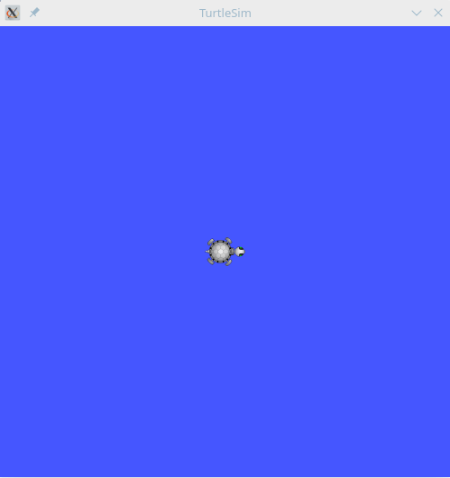

## ros 话题

接着前一节,先做一些准备工作

```shell
# 新建终端,执行
rosrun turtlesim turtlesim_node
# 新建终端,执行
rosrun turtlesim turtle_teleop_key # 通过键盘遥控turtle
```

turtlesim_node节点和turtle_teleop_key节点之间是通过一个ROS话题来相互通信的。turtle_teleop_key在话题上发布键盘按下的消息，turtlesim则订阅该话题以接收消息。

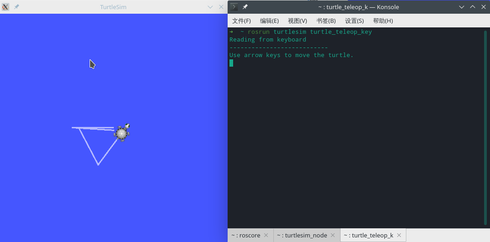

### rqt_graph

rqt_graph用动态的图显示了系统中正在发生的事情。

```shell
# 新建终端,执行
rosrun rqt_graph rqt_graph
```

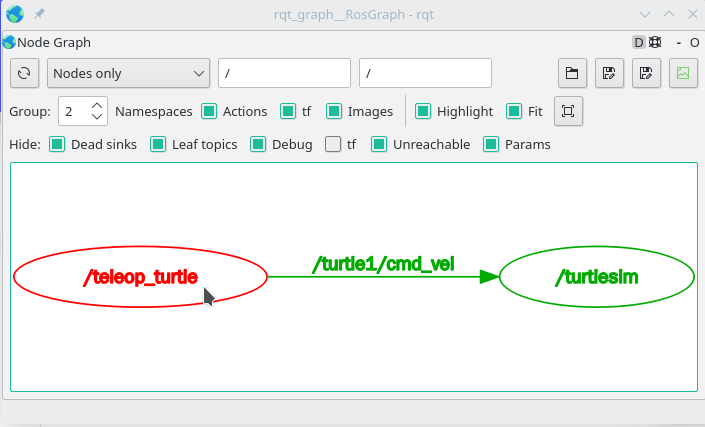

### rostopic

rostopic命令工具能让你获取ROS话题的信息

- rostopic echo 可以显示在某个话题上发布的数据。

  ```shell
  # 用法: rostopic echo [topic]
  rostopic echo /turtle1/cmd_vel # 显示在某个话题上发布的数据。
  ```

  通过按下键盘方向键让 turtle_teleop_key 节点发布数据,控制乌龟的运动,可以在 rostopic 的终端窗口捕获到运动信息

  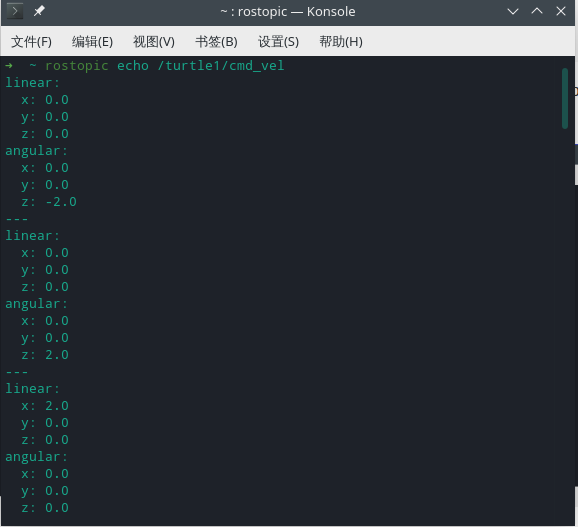

  现在让我们再看一下rqt_graph

  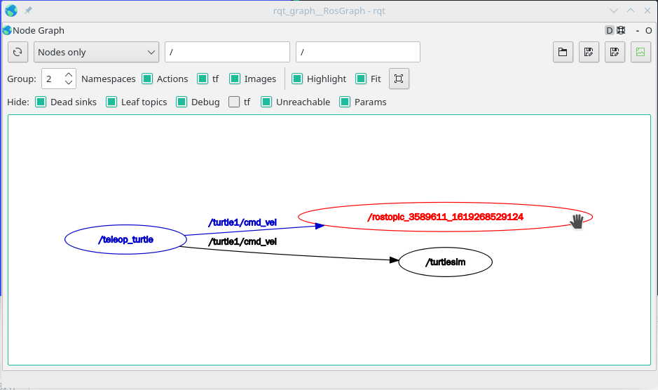

- rostopic list 能够列出当前已被订阅和发布的所有话题。

  ```shell
  rostopic list -v # 列出所有发布和订阅的主题及其类型的详细信息。
  ```

- rostopic type 命令用来查看所发布话题的消息类型。

  ```shell
  rostopic type /turtle1/cmd_vel
  rosmsg show geometry_msgs/Twist # rosmsg查看消息的详细信息
  ```

- rostopic pub 可以把数据发布到当前某个正在广播的话题上。

  ```shell
  # 用法: rostopic pub [topic] [msg_type] [args]
  # 发送一条消息给turtlesim，告诉它以2.0大小的线速度和1.8大小的角速度移动。
  rostopic pub -1 /turtle1/cmd_vel geometry_msgs/Twist -- '[2.0, 0.0, 0.0]' '[0.0, 0.0, 1.8]'
  ```

  参数分析: `-1` 让rostopic只发布一条消息，然后退出. 两个破折号 `--` 用来告诉选项解析器，表明之后的参数都不是选项

  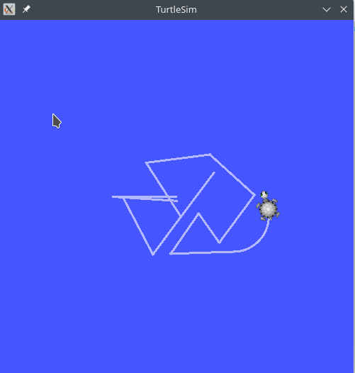

  ```shell
  rostopic pub /turtle1/cmd_vel geometry_msgs/Twist -r 1 -- '[2.0, 0.0, 0.0]' '[0.0, 0.0, -1.8]'
  ```

  rostopic pub -r 命令来发布源源不断的命令, 这里的 `1` 代表以 1 Hz 的速度发布

  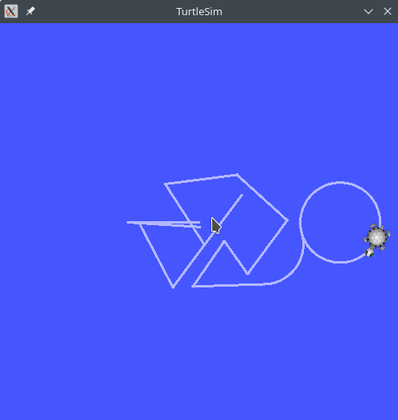

  我们再看一下rqt_graph,可以看出键盘和 `rostopic pub` 都在发送指令给小乌龟和 `rostopic echo` .

  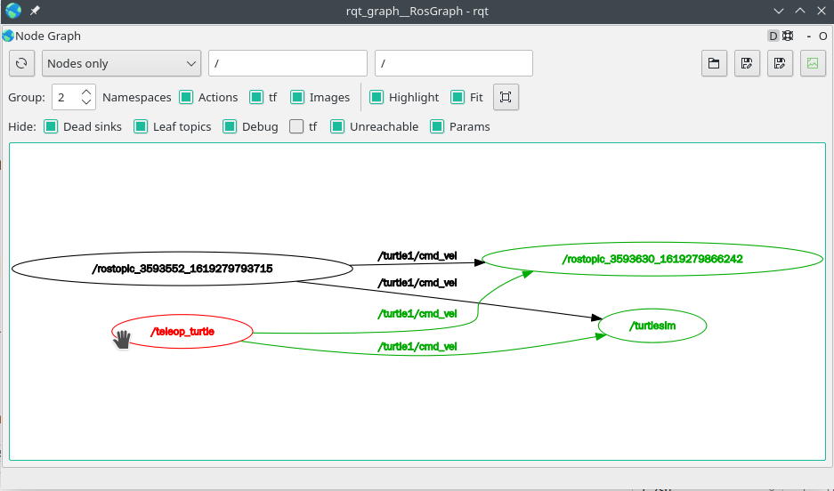

- rostopic hz 报告数据发布的速率。

  ```shell
  # 用法: rostopic hz [topic]
  rostopic hz /turtle1/pose
  ```

### rqt_plot

rqt_plot 命令可以在滚动时间图上显示发布到某个话题上的数据, 新建终端输入:

```shell
rosrun rqt_plot rqt_plot
```

在弹出的窗口文本框添加 `/turtle1/pose/x`, 点击 `+` 后, 再添加 `/turtle1/pose/y`, 现在你会在图中看到小乌龟的 x 和 y 位置.

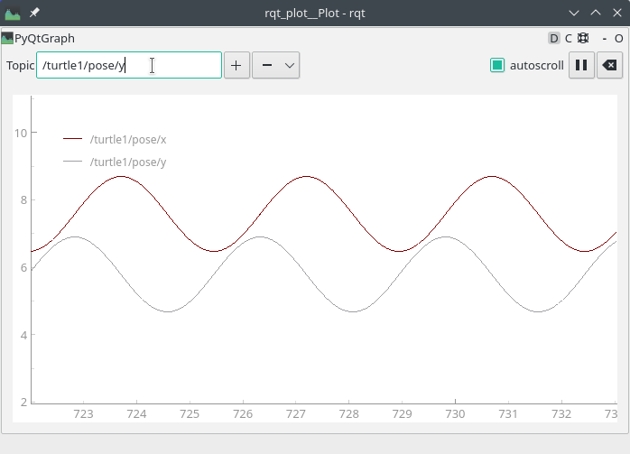

## ros 服务

服务（Services）是节点之间通讯的另一种方式。服务允许节点发送一个请求（request）并获得一个响应（response）

### rosseervice

rosservice可以很容易地通过服务附加到ROS客户端/服务器框架上。rosservice有许多可用于服务的命令，用法：

| 指令            | 说明                 |
| :-------------- | :------------------- |
| rosservice list | 输出活跃服务的信息   |
| rosservice call | 用给定的参数调用服务 |
| rosservice type | 输出服务的类型       |
| rosservice find | 按服务的类型查找服务 |
| rosservice uri  | 输出服务的ROSRPC uri |

``` shell
rosservice list
```

list命令显示turtlesim节点提供了9个服务：reset, clear, spawn, kill, turtle1/set_pen, /turtle1/teleport_absolute, /turtle1/teleport_relative, turtlesim/get_loggers, turtlesim/set_logger_level。同时还有两个与rosout节点有关的服务：/rosout/get_loggers和/rosout/set_logger_level。

``` shell
# 用法 : rosservice type [service]
rosservice type /clear # 查看clear服务的类型
rosservice type /spawn| rossrv show # 查看spawn服务的详细信息
```

rosservice type 可以输出服务的类型, 看到 `/clear` 服务的类型为 empty（空），这表明调用这个服务时不需要参数.

``` shell
# 用法 : rosservice call [service] [args]
rosservice call /clear # 调用clear服务
rosservice call /spawm 2 2 0.2 "" # 给定的位置和角度生成一只新的乌龟
```

调用 `/clear` 服务, 清除了小乌龟运动的轨迹

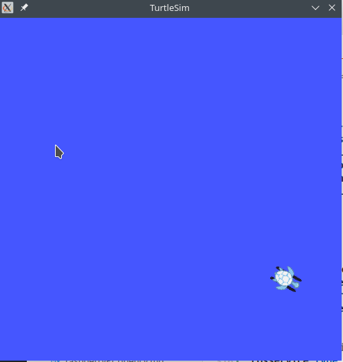

调用 `/spawn` 服务, 并设置好参数,生成一只新的乌龟

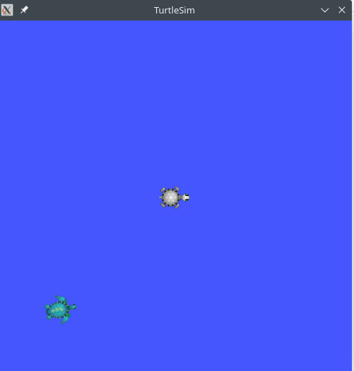

### rosparam

rosparam能让我们在ROS参数服务器（Parameter Server）上存储和操作数据。参数服务器能够存储整型（integer）、浮点（float）、布尔（boolean）、字典（dictionaries）和列表（list）等数据类型。rosparam使用YAML标记语言的语法。

| 指令            | 说明             |
| :-------------- | :--------------- |
| rosparam set    | 设置参数         |
| rosparam get    | 获取参数         |
| rosparam load   | 从文件中加载参数 |
| rosparam dump   | 向文件中转储参数 |
| rosparam delete | 删除参数         |
| rosparam list   | 列出参数名       |

``` shell
rosparam list # 查看参数名
rosparam set /background_b 150  # 修改背景色的红色通道的值
rosservice call /clear # 调用clear服务生效参数修改
rosparam get /background_g # 获取背景的绿色通道的值
rosparam dump params.yaml # 将所有的参数写入params.yaml文件
# 将yaml文件重载入新的命名空间
rosparam load params.yaml copy_turtle
rosparam get /copy_turtle/background_b
```

## rqt_console 和 roslaunch

### rqt_console和rqt_logger_level

rqt_console 连接到了 ros 的日志框架，以显示节点的输出信息。rqt_logger_level 允许我们在节点运行时改变输出信息的详细级别，包括 Debug 、 Info 、 Warn 和 Error 。

```shell
rosrun rqt_console rqt_console
rosrun rqt_logger_level rqt_logger_level
```

日志级别的优先级按以下顺序排列：

- Fatal （致命）
- Error （错误）
- Warn  （警告）
- Info  （信息）
- Debug （调试）

Fatal是最高优先级，Debug是最低优先级。通过设置日志级别，你可以获得所有优先级级别，或只是更高级别的消息。比如，将日志级别设为Warn时，你会得到Warn、Error和Fatal这三个等级的日志消息。

### roslaunch

roslaunch可以用来启动定义在launch（启动）文件中的节点。

用法: roslaunch [package] [filename.launch]

在之前创建的 beginner_tutorials 软件包目录下

```shell
roscd beginner_tutorials # 进入 beginner_tutorials 软件包目录
mkdir launch
cd launch
vim turtlemimic.launch
```

在 turtlemimic.launch 文件中添加以下内容

```xml
<launch>

<!-- 此处我们创建了两个分组，并以命名空间（namespace）标签来区分，其中一个名为turtulesim1，另一个名为turtlesim2，两个分组中都有相同的名为sim的turtlesim节点。这样可以让我们同时启动两个turtlesim模拟器，而不会产生命名冲突。 -->
  <group ns="turtlesim1">
    <node pkg="turtlesim" name="sim" type="turtlesim_node"/>
  </group>

  <group ns="turtlesim2">
    <node pkg="turtlesim" name="sim" type="turtlesim_node"/>
  </group>

<!-- 在这里我们启动模仿节点，话题的输入和输出分别重命名为turtlesim1和turtlesim2，这样就可以让turtlesim2模仿turtlesim1了。 -->
  <node pkg="turtlesim" name="mimic" type="mimic">
    <remap from="input" to="turtlesim1/turtle1"/>
    <remap from="output" to="turtlesim2/turtle1"/>
  </node>

</launch>
```

通过roslaunch命令来运行launch文件

```shell
roslaunch beginner_tutorials turtlemimic.launch
```

新建一个终端发送以下指令,看到两个turtlesims同时开始移动，虽然发布命令只发送给了turtlesim1。

```shell
rostopic pub /turtlesim1/turtle1/cmd_vel geometry_msgs/Twist -r 1 -- '[2.0, 0.0, 0.0]' '[0.0, 0.0, -1.8]'
```

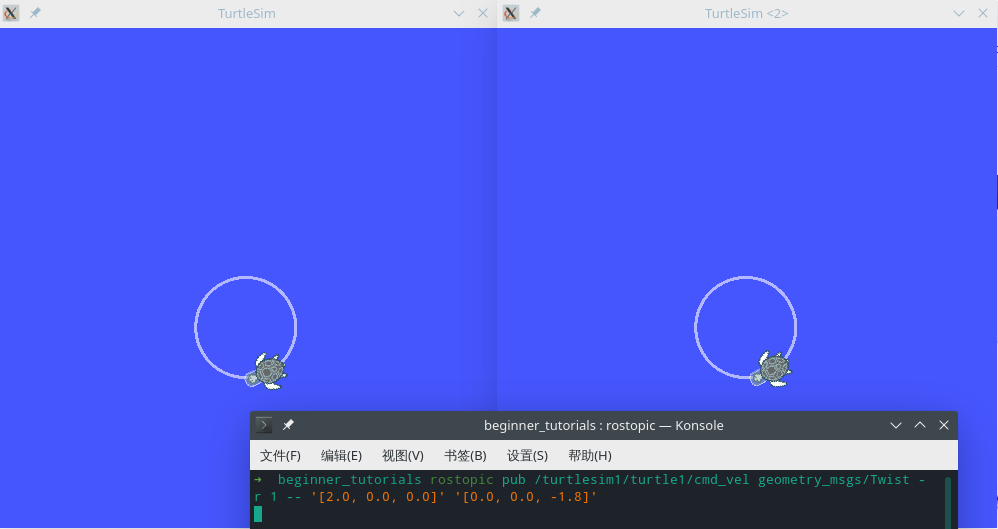

打开 rqt_graph 查看过程

```shell
rqt_graph
```

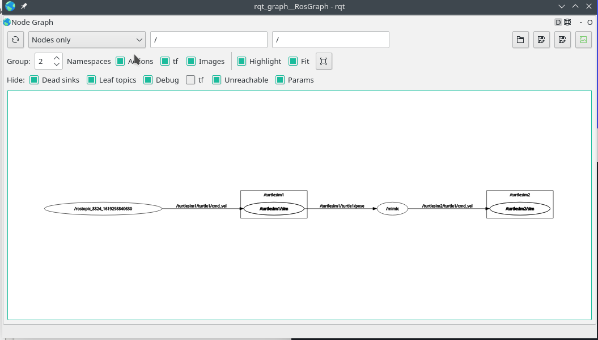

## 报错及解决办法

### Error: the rosdep view is empty: call 'sudo rosdep init' and 'rosdep update' 学习 ROS 时,运行 rospack depends1 XXX 报错的解决办法

学习 ros 官网的 wiki 时, 使用 `rospack depends1 XXX` 报错:

Error: the rosdep view is empty: call 'sudo rosdep init' and 'rosdep update'

我使用的是树莓派的 ubuntu 20.04 系统, 安装的 ROS 版本为 `ROS Noetic Ninjemys`, 以下为报错的解决办法.

```shell
sudo apt install python3-rosdep2 # 安装rosdep
sudo rm -rf $HOME/.ros/rosdep && sudo rm -rf /etc/.ros/rosdep # 删除 rosdep 原有文件
```

```shell
sudo vim /etc/hosts # 修改 `hosts` 文件
```

修改 `/etc/hosts` 文件,在末尾添加:

```shell
151.101.84.133  raw.githubusercontent.com
```

接着按照提示运行,注意要先运行 `sudo rosdep init` ,后再运行 `rosdep update`

```shell
sudo rosdep init
rosdep update
```

以上指令没有错误再运行,可能出现的错误下面会接着介绍

``` shell
sudo apt install ros-noetic-desktop-full # 重新安装 ROS
```

**注意**: 运行 `sudo rosdep init` 可能会出现以下提示,只需要删除`/etc/ros/rosdep/sources.list.d/20-default.list`文件即可

```shell
ERROR: default sources list file already exists:
        /etc/ros/rosdep/sources.list.d/20-default.list
Please delete if you wish to re-initialize
```

删除文件后重新运行 `sudo rosdep init`, 正确输出应该如下所示

```shell
Wrote /etc/ros/rosdep/sources.list.d/20-default.list
Recommended: please run

        rosdep update
```

以下为运行 `rosdep update` 的正确输出

```shell
reading in sources list data from /etc/ros/rosdep/sources.list.d
Hit https://raw.githubusercontent.com/ros/rosdistro/master/rosdep/osx-homebrew.yaml
Hit https://raw.githubusercontent.com/ros/rosdistro/master/rosdep/base.yaml
Hit https://raw.githubusercontent.com/ros/rosdistro/master/rosdep/python.yaml
Hit https://raw.githubusercontent.com/ros/rosdistro/master/rosdep/ruby.yaml
Hit https://raw.githubusercontent.com/ros/rosdistro/master/releases/fuerte.yaml
Query rosdistro index https://raw.githubusercontent.com/ros/rosdistro/master/index-v4.yaml
Skip end-of-life distro "ardent"
Skip end-of-life distro "bouncy"
Skip end-of-life distro "crystal"
Add distro "dashing"
Skip end-of-life distro "eloquent"
Add distro "foxy"
Add distro "galactic"
Skip end-of-life distro "groovy"
Skip end-of-life distro "hydro"
Skip end-of-life distro "indigo"
Skip end-of-life distro "jade"
Add distro "kinetic"
Skip end-of-life distro "lunar"
Add distro "melodic"
Add distro "noetic"
Add distro "rolling"
updated cache in /home/ubuntu/.ros/rosdep/sources.cache
```

### RuntimeError: No usable plot type found. Install at least one of: PyQtGraph, MatPlotLib (at least 1.4.0) or Python-Qwt5. 运行 rosrun rqt_plot rqt_plot 报错的解决办法

```shell
pip install PyQtGraph
```
