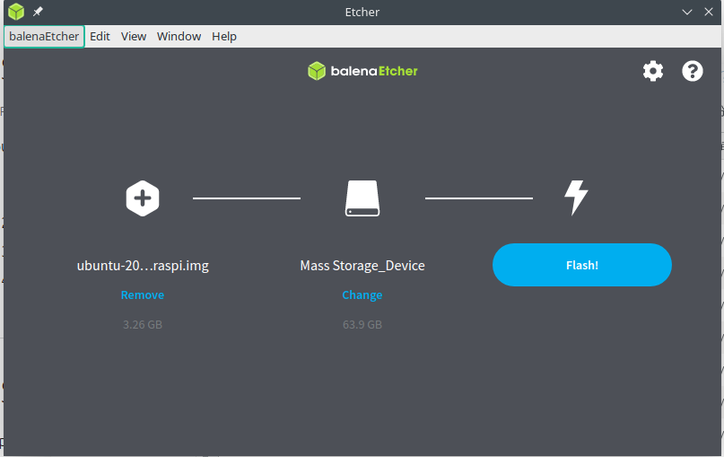

# 树莓派4安装 ubuntu

- [树莓派4安装 ubuntu](#树莓派4安装-ubuntu)
  - [下载](#下载)
  - [烧录镜像](#烧录镜像)
  - [添加 wifi 设置](#添加-wifi-设置)
  - [ssh连接树莓派](#ssh连接树莓派)
  - [apt 换源](#apt-换源)
  - [vnc远程连接桌面](#vnc远程连接桌面)

## 下载
到官网下载ubuntu-server镜像，[镜像链接](https://ubuntu.com/download/raspberry-pi)


## 烧录镜像

解压下载好的镜像文件,一张较大的sd卡(这里为64g), 使用 balenaEtcher 软件烧录镜像.



## 添加 wifi 设置

烧录好镜像后,可以看到多了两个分区,找到 `system-boot` 分区中的 `network-config` 配置文件,打开后在末尾添加:

```shell
wifis:
  wlan0:
    dhcp4: true
    optional: true
    access-points:
      "你的无线SSID":
        password: "你的无线密码"
```

将sd卡插入树莓派中,启动一次,如果没有连接,断开再启动一次.


## ssh连接树莓派

查找树莓派 ip 地址(可以通过路由器查看,也可以使用 nmap 工具) ,ssh的默认帐号和密码都是 `ubuntu`,登录后需要重新设置密码.


## apt 换源

首先是apt配置文件备份,然后使用打开配置文件

``` shell
sudo cp /etc/apt/sources.list /etc/apt/sources.list.bak
sudo vim /etc/apt/sources.list
```

打开文件后,清空,将以下内容添加到文件中

``` shell
deb https://mirrors.ustc.edu.cn/ubuntu-ports/ focal main restricted universe multiverse
deb https://mirrors.ustc.edu.cn/ubuntu-ports/ focal-updates main restricted universe multiverse
deb https://mirrors.ustc.edu.cn/ubuntu-ports/ focal-backports main restricted universe multiverse
deb https://mirrors.ustc.edu.cn/ubuntu-ports/ focal-security main restricted universe multiverse
```

## vnc远程连接桌面

``` shell
sudo apt update && sudo apt upgrade #更新 apt 包
sudo apt ubuntu-desktop gnome-panel xorg dbus-x11 x11-xserver-utils #安装ubuntu默认桌面环境
sudo apt install tightvncserver #安装 tightvncserver
vncserver   #启动vncserver
```


打开vnc软件,远程登录后还是一片灰白,还需要设置

```shell
vncserver -kill :1  #关闭窗口1
vim ~/.vnc/xstartup #编辑配置文件
```

将配置文件的内容修改为以下内容,再次执行 `vncserver` 命令.

```shell
#!/bin/sh

export XKL_XMODMAP_DISABLE=1
unset SESSION_MANAGER
unset DBUS_SESSION_BUS_ADDRESS

export XKL_XMODMAP_DISABLE=1
export XDG_CURRENT_DESKTOP="GNOME-Flashback:Unity"
export XDG_MENU_PREFIX="gnome-flashback-"

[ -x /etc/vnc/xstartup ] && exec /etc/vnc/xstartup
[ -r $HOME/.Xresources ] && xrdb $HOME/.Xresources
xsetroot -solid grey
vncconfig -iconic &

gnome-session --session=gnome-flashback-metacity --disable-acceleration-check &
gnome-panel &
gnome-settings-daemon &
metacity &
nautilus &
gnome-terminal &
```

